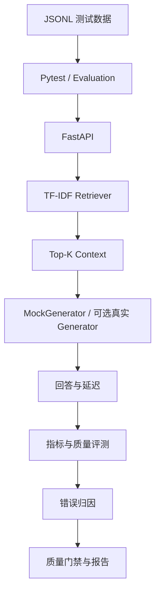

# RAG 智能客服自动化测试与质量评测系统

英文名：RAG AI Testing Platform。

这是一个面向 2027 届测试开发、AI 测试和测试工程师岗位的项目级 MVP。重点不是训练模型，而是展示如何为 RAG 应用建立可解释、可复现的自动化测试与质量评测体系。

## 项目架构



## 目录说明

- `app/`：FastAPI 应用和请求模型。
- `rag/`：Retriever、Generator 和 RAGService。
- `evaluation/`：检索指标、回答质量和错误归因。
- `data/`：知识库和 JSONL 测试集。
- `tests/`：API、Retriever、Generator、指标、归因和 E2E 测试。
- `scripts/`：质量评测和版本回归。
- `config/`：项目自定义质量门禁阈值。
- `performance/`：Locust 接口压测脚本。
- `reports/`：真实运行生成的报告。
- `docs/`：项目面试讲解材料。

## RAG 流程

问题先交给 `TfidfRetriever.retrieve()`，返回 Top-K 文档；`RAGService.chat()` 再把上下文交给 `MockGenerator.generate()`。MockGenerator 不调用真实大模型，保证本地测试稳定、快速、可复现。未来可以只替换 Retriever 或 Generator 实现。

## 检索指标

- **Hit@K**：前 K 个结果是否至少命中一个参考文档。
- **Recall@K**：命中的参考文档占全部参考文档的比例。
- **Precision@K**：前 K 个结果中相关文档的比例。
- **MRR**：第一个正确文档排名的倒数。

Evaluation 还按 `category`、`difficulty` 和 `case_type` 分组，帮助定位复杂、多文档或知识缺失场景的薄弱点。

## 回答质量

- **Keyword Coverage**：期望关键词命中比例。
- **Answer Correctness**：基于 Ground Truth 和关键词的规则评分。
- **Refusal Accuracy**：知识库无答案时是否明确拒答。
- **Faithfulness**：当前是 `Rule-based Faithfulness Baseline`，检查回答事实能否在 Context 中找到支持；不能替代完整语义评测。

## 错误归因

- `RETRIEVAL_FAILURE`：参考文档没有进入 Top-K。
- `GENERATION_FAILURE`：正确文档已进入 Top-K，但核心关键词缺失。
- `HALLUCINATION`：回答事实无法由上下文支持。
- `REFUSAL_FAILURE`：知识库没有答案，但系统仍给出确定性业务回答。
- `SYSTEM_ERROR`：接口或程序异常。
- `PASS`：检索、回答和拒答均符合预期。

## 安装与运行

```powershell
cd C:\Users\lenovo\Desktop\项目
pip install -r requirements.txt
python -m pytest -v
python scripts/run_evaluation.py
python scripts/run_regression.py
```

启动服务：

```powershell
python -m uvicorn app.main:app --reload
```

Swagger：`http://127.0.0.1:8000/docs`

生成 Allure 数据：

```powershell
python -m pytest --alluredir=reports/allure-results
```

本机有 Allure CLI 时：

```powershell
allure serve reports/allure-results
```

运行 Locust：

```powershell
locust -f performance/locustfile.py --host http://127.0.0.1:8000
```

性能数字必须来自真实压测，未执行时不编造。

## 质量门禁

`config/quality_gate.json` 是本项目为了演示 AI Release Quality Gate 设置的自定义阈值，不代表行业统一标准。评测低于阈值时，`run_evaluation.py` 返回非 0 退出码。

## 当前限制

- Retriever 仍是 TF-IDF 基线，语义理解能力有限。
- MockGenerator 用于确定性测试，不代表真实 LLM 质量。
- Rule-based Faithfulness 不能完全代替语义评测。
- 真实 LLM 存在随机性、成本和服务稳定性问题。
- 测试集是项目级规模，不是工业级数据集。

后续可扩展 Embedding Retriever、FAISS/Chroma、RAGAS、LLM-as-a-Judge 和 CI/CD，但不应为了堆技术而脱离测试目标。

## 面试重点

1. 为什么 HTTP 200 不能证明 RAG 回答正确？
2. 为什么要把 Retriever 和 Generator 分开测试？
3. Hit@K、Recall@K、Precision@K、MRR 各自解决什么问题？
4. 如何区分检索失败、生成失败和幻觉？
5. 为什么 MockGenerator 在 AI 测试项目中仍有价值？
